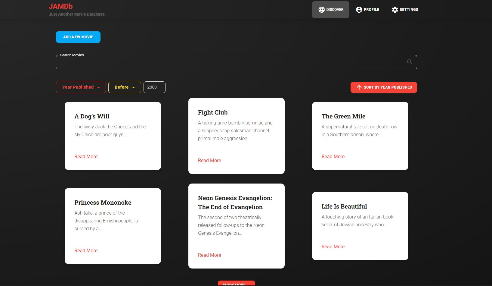

# JAMDb - Just Another Movie Database

JAMDb - Just Another Movie Database is an application for storing movie information. The application supports multiple functionalities such as searching, adding more movies, sorting and viewing more detailed information.

The application consists of three parts - frontend, backend and a database.
All three must be running for the application to work properly.

## Running the application:

Check out [backend](backend/) and [frontend](frontend/).

## Folder structure:

    JAMDb
    ├── backend
    │   ├── src                     # Source directory
    │   │   ├── movie               # Movie directory containing resolvers, schema and services
    │   │   ├── app.module.ts       # Main NestJS module
    │   │   └── main.ts             # NestJS main
    |   |
    |   └── ...
    |
    ├── frontend
    │   ├── cypress                 # Cypress configuration and tests
    │   ├── public                  # Public directory
    │   ├── src                     # Source directory
    │   │   ├── app                 # App directory
    │   │   │   ├── components      # Custom React Components
    │   │   │   ├── grapQL          # GraphQL config
    │   │   │   ├── services        # API service directory
    │   │   │   ├── slices          # Redux slices
    │   │   │   ├── hooks.ts        # React hooks
    │   │   │   └── store.ts        # Redux store config
    │   │   │
    │   │   ├── styles              # Style directory
    │   │   ├── tests               # Test directory for Jest unit tests
    |   |   |    ├── components     # Unit test for components
    |   |   |    └── services       # Unit test for services
    |   |   |
    │   │   ├── App.tsx             # Root component
    │   │   └── index.tsx           # Entry point for react
    |   |
    |   └── ...

# Frontend

Our [frontend](frontend/) is made using [React](https://reactjs.org/) with TypeScript.

- CRUD operations to our backend server is done using [GraphQL](https://graphql.org/) and the [Apollo Client](https://github.com/apollographql/apollo-client).
- State management is done using [Redux Toolkit](https://redux-toolkit.js.org/), a wrapper around the well known [Redux](https://redux.js.org/) library.
- Styling is done using [Tailwind](https://tailwindcss.com/) and [material-tailwind](https://material-tailwind.com/).
- Testing is done with [Jest](https://jestjs.io/)

## GraphQL / Apollo

Our API related code resides in our [movieService](frontend/src/app/services/movieService) folder. Here you'll find the queries, our APIservice class and some auto-generated files generated from the schema downloaded from the server. Scripts for downloading and generating these files can be found in [package.json](frontend/package.json) as `schema:download` and `schema:generate-watch` respectively.

## Tailwind

[Tailwind](https://tailwindcss.com/) is a highly customizable CSS framework. \
We chose to use Tailwind because:

- It eliminates the complexity of traditional CSS styling and makes the code more maintainable.
- It's much faster to write and makes consistency in styling easier.

In addition, we also chose to use [Material Tailwind](https://material-tailwind.com/documentation/quick-start), which is a component library for tailwind containing the most common components like buttons, and forms.

> Note: Material Tailwind is not officially supported by TypeScript, warnings and errors from TypeScript and ESlint, therefore has to be explicitly ignored when importing the components.

## Redux

[Redux](https://redux.js.org/) is a state management library designed to make state management centralized, more predictable and traceable, and easier to scale.

[Redux Toolkit](https://redux-toolkit.js.org/) is a wrapper around the traditional redux implementation designed to make the initial setup process easier, decrease boilerplate code, and improve readability.

Our app stores the result of a search in state.

  

# Database

Our database runs MongoDB, an easy to use, document-oriented database. We chose MongoDB because it is well known, and the setup and usage with nest it's well documented in the Nest docs.

> The Database is currently running on a server that requires an active VPN connection to Norwegian University of Science and Technology.

  

# Backend

Our [Backend](backend/) is built using NestJS, a NodeJS framework built as a wrapper around ExpressJS. We chose Nest because it fully embraces TypeScript and provides more structure than express. It also provides an easy to use cli for developing and maintaining code.

- For interaction between our backend and the database we use [MongooseJS](https://mongoosejs.com/).
- Our API endpoint is made using [Apollo server](https://www.apollographql.com/docs/apollo-server/).

## MongooseJS (mongoDB)

Interaction between our backend server and our database server is done using [MongooseJS](https://mongoosejs.com/), a Object Modeling Tool built on top of the native [MongoDB driver](https://www.npmjs.com/package/mongodb). NestJS provides mongoose as a module (@NestJS/mongoose), which simplifies the setup process and provides extra"quality of life" functionality like automatic generation of schemas based on decorators. This reduces boilerplate code, speeds up development and increases readability.

## GraphQL / Apollo

We use [Apollo](https://www.apollographql.com/docs/apollo-server/) as our [GraphQL](https://graphql.org/) server using built-in nest [module](https://docs.nestjs.com/graphql/quick-start). Our implementation uses the 'code first approach' where we build our classes and add decorators that automatically generates a graphQL schema. This eliminates the process of manually typing schemas, speeding up the development process.

> API documentation can be found on http://it2810-51.idi.ntnu.no:4000/graphql

  

# Testing

Testing has been done mostly on the frontend, seeing as this was what was required from the problem description. The test folder in frontend is ment to mirror the normal folderstructure to make it easy to navigate and find.

The tests comprise of:

- **Unit tests, with [Jest](https://jestjs.io/docs/tutorial-react)**
- **End to end tests, with [Cypress](https://www.cypress.io/)**

## React - Jest

With the react-jest framework we are able to test invidivudal components, such as if they are rendering correctly with **Redux** and **React-router**. We can also test functions within react components.

## Cypress

Cypress allows for E2E testing where we program how user input should behave and what we expect the outcome of multiple user interactions to result in.

There is currently a _layout.spec.ts_ file where it tests for layout. And a _action.spec.ts_ to check different user actions on the client.

> In order to use _TypeScript_ in Cypress we need to install webpack and setup a webpack config in the **Cypress** folder. However when we do this the **create-react-app** build fails to build since there are two webpack dependencies. In order to temporary solve this problem we can create and .env file with the key: `SKIP_PREFLIGHT_CHECK=true`
